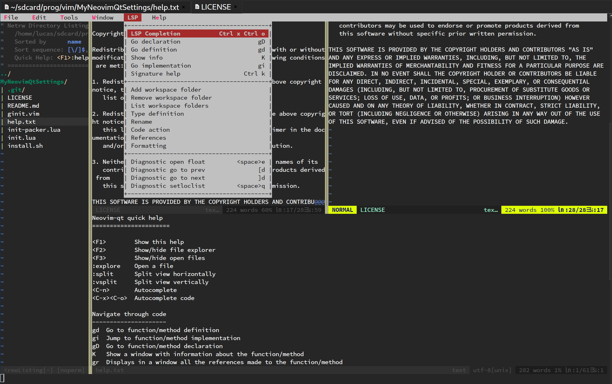

# MyNeovimQtSettings

A simple script to install my neovim-qt settings.

To install, write in your terminal:

```
$ bash install.sh
```

Press q or :q when process has been finished.

Installed plugins can be check in "init-packer.lua" file.

Press space twice to open the menu.



